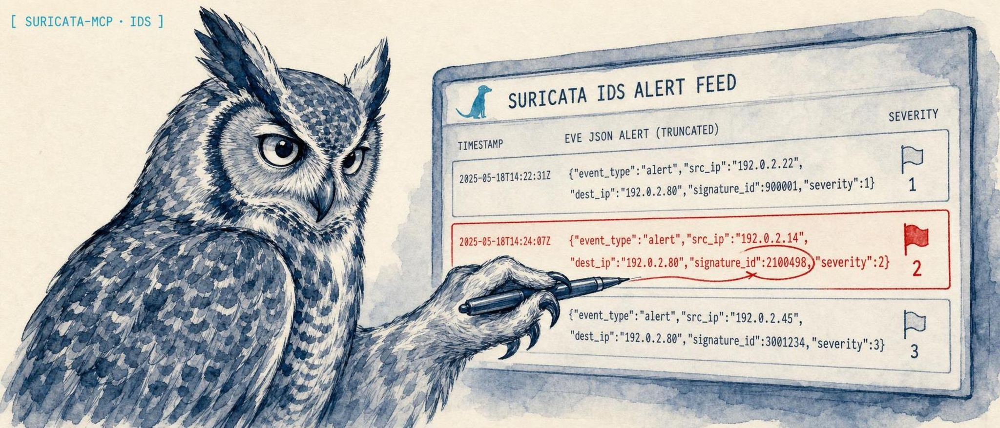

<p align="center">
  
</p>

<h1 align="center">suricata-mcp</h1>

<p align="center">
  <strong>An MCP server that lets an AI client read and triage Suricata IDS/IPS and Zeek NSM telemetry, so alert investigation happens in natural language instead of grep over EVE JSON.</strong>
</p>

<p align="center">
  <a href="https://lidless.dev/suricata-mcp"><strong>Website &amp; docs -&gt; lidless.dev/suricata-mcp</strong></a>
</p>

<p align="center">
  
  
  
  
</p>

suricata-mcp is a Model Context Protocol (MCP) server for network security monitoring: it exposes Suricata IDS/IPS alerts and Zeek NSM logs to an AI client as structured tools. **Why:** a SOC analyst chasing a single alert normally pivots by hand across `eve.json`, flow records, DNS/HTTP/TLS transactions, and the Zeek logs next to them, which is slow and easy to get wrong under pressure. **How it differs:** instead of a dashboard or a one-shot log shipper, it gives the model query, aggregation, correlation, and threat-hunting tools that run locally against your own log files, with cross-correlation between Suricata and Zeek and built-in analytics for C2 beaconing, DGA, exfiltration, and lateral movement, so the analyst asks questions in plain language and the model does the pivoting.

## What it does

suricata-mcp is an MCP server for **Suricata** IDS/IPS and **Zeek** network-security monitoring. It reads Suricata **EVE JSON** alerts, flows, and protocol records (DNS, HTTP, TLS/JA3/JA4, SSH, fileinfo, anomalies) and Zeek TSV logs straight off disk, then exposes them to an AI client as MCP tools for querying, aggregation, timelines, host and alert investigation, and cross-sensor correlation. On top of the raw telemetry it ships intrusion-detection analytics, C2 beaconing detection, DGA domain detection via Shannon entropy, data-exfiltration detection, and lateral-movement detection, plus Suricata rule management and optional threat-intel pivots into MISP and TheHive. The server is **read-only by default**: every analysis tool works out of the box, and the handful of tools that change a live IDS or shell out stay disabled until you explicitly opt in. It speaks MCP over stdio, so it drops into Claude Desktop, Claude Code, Codex CLI, OpenClaw, Hermes, or any MCP-capable agent.

## Installation

Most clients can run the published package directly with `npx -y suricata-mcp` (see [Quickstart](#quickstart)). To work from source instead:

```bash
git clone https://github.com/lidless-labs/suricata-mcp.git
cd suricata-mcp
npm install
npm run build
```

## Quickstart

Add suricata-mcp to any MCP client with the published npm package. No clone or build required:

```json
{
  "mcpServers": {
    "suricata": {
      "command": "npx",
      "args": ["-y", "suricata-mcp"],
      "env": {
        "SURICATA_EVE_LOG": "/var/log/suricata/eve.json",
        "SURICATA_RULES_DIR": "/etc/suricata/rules",
        "ZEEK_LOGS_DIR": "/opt/zeek/logs"
      }
    }
  }
}
```

That is the entire install. The server starts read-only against the logs you point it at; everything below is configuration detail and per-client wiring.

## Usage

### Claude Desktop

Add to `~/Library/Application Support/Claude/claude_desktop_config.json` (macOS) or `%APPDATA%\Claude\claude_desktop_config.json` (Windows):

```json
{
  "mcpServers": {
    "suricata": {
      "command": "npx",
      "args": ["-y", "suricata-mcp"],
      "env": {
        "SURICATA_EVE_LOG": "/opt/nids/suricata/logs/eve.json",
        "SURICATA_RULES_DIR": "/opt/nids/suricata/rules",
        "ZEEK_LOGS_DIR": "/opt/nids/zeek/logs",
        "PCAP_DIR": "/opt/nids/pcaps",
        "MISP_URL": "https://misp.local",
        "MISP_API_KEY": "your-key",
        "THEHIVE_URL": "http://thehive.local:9000",
        "THEHIVE_API_KEY": "your-key"
      }
    }
  }
}
```

If you installed from source, set `"command": "suricata-mcp"` (global npm install) or `"command": "node"` with `"args": ["/absolute/path/to/suricata-mcp/dist/mcp-bin.js"]`.

## suricatactrl CLI

`suricatactrl` is the operator CLI for quick local triage. The package also keeps `suricatactl` as a compatibility alias. `suricata-mcp` remains the MCP stdio adapter for AI clients.

```bash
npx -y --package suricata-mcp suricatactrl status --json
SURICATA_EVE_LOG=./test-data/eve.json SURICATA_EVE_ARCHIVE=./test-data npx -y --package suricata-mcp suricatactrl alerts query --severity 1 --limit 5
SURICATA_EVE_LOG=./test-data/eve.json SURICATA_EVE_ARCHIVE=./test-data npx -y --package suricata-mcp suricatactrl flows query --app-proto http --json
SURICATA_EVE_LOG=./test-data/eve.json SURICATA_EVE_ARCHIVE=./test-data npx -y --package suricata-mcp suricatactrl dns query --query evil-domain
```

From a source checkout after `npm run build`:

```bash
SURICATA_EVE_LOG=./test-data/eve.json SURICATA_EVE_ARCHIVE=./test-data node dist/cli.js status
SURICATA_EVE_LOG=./test-data/eve.json SURICATA_EVE_ARCHIVE=./test-data node dist/cli.js alerts query --sid 2024001
node dist/cli.js mcp
```

The first CLI slice is read-only. It covers setup checks, alert queries, flow queries, DNS queries, and beaconing detection with `--json` output for scripts. Use the MCP server for the full tool set, including rule mutation, Unix socket commands, PCAP workflows, cross-sensor correlation, MISP, and TheHive.

### Claude Code

```bash
claude mcp add suricata \
  --env SURICATA_EVE_LOG=/opt/nids/suricata/logs/eve.json \
  --env SURICATA_RULES_DIR=/opt/nids/suricata/rules \
  --env ZEEK_LOGS_DIR=/opt/nids/zeek/logs \
  -- npx -y suricata-mcp
```

Add `--scope user` to make it available from any directory instead of only the current project.

### OpenClaw

If you're running from a source checkout instead of the npm-installed binary, point `command`/`args` at the built `dist/mcp-bin.js`:

```bash
openclaw mcp set suricata '{
  "command": "node",
  "args": ["/absolute/path/to/suricata-mcp/dist/mcp-bin.js"],
  "env": {
    "SURICATA_EVE_LOG": "/opt/nids/suricata/logs/eve.json",
    "SURICATA_RULES_DIR": "/opt/nids/suricata/rules",
    "ZEEK_LOGS_DIR": "/opt/nids/zeek/logs"
  }
}'
```

Or, with the published package:

```bash
openclaw mcp set suricata '{
  "command": "npx",
  "args": ["-y", "suricata-mcp"],
  "env": {
    "SURICATA_EVE_LOG": "/opt/nids/suricata/logs/eve.json",
    "SURICATA_RULES_DIR": "/opt/nids/suricata/rules",
    "ZEEK_LOGS_DIR": "/opt/nids/zeek/logs"
  }
}'
```

Then restart the OpenClaw gateway so the new server is picked up:

```bash
systemctl --user restart openclaw-gateway
openclaw mcp list   # confirm "suricata" is registered
```

### Hermes Agent

[Hermes Agent](https://github.com/NousResearch/hermes-agent) reads MCP config from `~/.hermes/config.yaml` under the `mcp_servers` key. Add an entry:

```yaml
mcp_servers:
  suricata:
    command: "npx"
    args: ["-y", "suricata-mcp"]
    env:
      SURICATA_EVE_LOG: "/opt/nids/suricata/logs/eve.json"
      SURICATA_RULES_DIR: "/opt/nids/suricata/rules"
      ZEEK_LOGS_DIR: "/opt/nids/zeek/logs"
```

Or, when running from a source checkout instead of the published package:

```yaml
mcp_servers:
  suricata:
    command: "node"
    args: ["/absolute/path/to/suricata-mcp/dist/mcp-bin.js"]
    env:
      SURICATA_EVE_LOG: "/opt/nids/suricata/logs/eve.json"
      SURICATA_RULES_DIR: "/opt/nids/suricata/rules"
      ZEEK_LOGS_DIR: "/opt/nids/zeek/logs"
```

Then reload MCP from inside a Hermes session:

```
/reload-mcp
```

### Codex CLI

[Codex CLI](https://github.com/openai/codex) registers MCP servers via `codex mcp add`:

```bash
codex mcp add suricata \
  --env SURICATA_EVE_LOG=/opt/nids/suricata/logs/eve.json \
  --env SURICATA_RULES_DIR=/opt/nids/suricata/rules \
  --env ZEEK_LOGS_DIR=/opt/nids/zeek/logs \
  -- npx -y suricata-mcp
```

Or, when running from a source checkout:

```bash
codex mcp add suricata \
  --env SURICATA_EVE_LOG=/opt/nids/suricata/logs/eve.json \
  --env SURICATA_RULES_DIR=/opt/nids/suricata/rules \
  --env ZEEK_LOGS_DIR=/opt/nids/zeek/logs \
  -- node /absolute/path/to/suricata-mcp/dist/mcp-bin.js
```

Codex writes the entry to `~/.codex/config.toml` under `[mcp_servers.suricata]`. Verify with:

```bash
codex mcp list
```

### Standalone

```bash
SURICATA_EVE_LOG=/var/log/suricata/eve.json \
ZEEK_LOGS_DIR=/opt/zeek/logs \
node dist/mcp-bin.js
```

### Development

```bash
npm run dev          # Watch mode with tsx
npm run build        # Production build
npm test             # Run test suite (158 tests)
npm run lint         # Type-check
```

## Tools

### Suricata Alert Analysis (4 tools)

| Tool | Description |
|------|-------------|
| `suricata_query_alerts` | Search alerts by SID, signature, category, severity, IP, port, protocol, action, time range |
| `suricata_alert_summary` | Aggregated alert statistics grouped by signature, category, severity, source, or destination |
| `suricata_top_alerts` | Top alerts by frequency and severity with unique source/destination counts |
| `suricata_alert_timeline` | Time-bucketed alert counts with severity breakdown |

### Suricata Flow Analysis (2 tools)

| Tool | Description |
|------|-------------|
| `suricata_query_flows` | Search flows by IP, port, protocol, app protocol, bytes, duration, state |
| `suricata_flow_summary` | Top talkers, protocol distribution, bandwidth stats |

### Suricata Protocol Analysis (6 tools)

| Tool | Description |
|------|-------------|
| `suricata_query_dns` | Search DNS queries by name, source IP, record type, response code |
| `suricata_query_http` | Search HTTP transactions by hostname, URL, method, status, user-agent |
| `suricata_query_tls` | Search TLS connections by SNI, JA3/JA4, certificate subject/issuer |
| `suricata_query_ssh` | Search SSH connections by client/server software version |
| `suricata_query_fileinfo` | Search extracted files by name, magic type, hash, size |
| `suricata_query_anomalies` | Search protocol anomalies by type, source/destination IP |

### Suricata Rule Management (5 tools)

| Tool | Description |
|------|-------------|
| `suricata_search_rules` | Search rule files by SID, message, classtype, reference, content |
| `suricata_rule_stats` | Rule set statistics: total, enabled/disabled, by action, by classtype |
| `suricata_create_rule` | Write a custom rule to local.rules |
| `suricata_toggle_rule` | Enable or disable a rule by SID |
| `suricata_reload_rules_docker` | Reload rules via Docker (suricata-update + SIGUSR2) |

### Suricata Engine & Live Commands (3 tools)

| Tool | Description |
|------|-------------|
| `suricata_engine_stats` | Capture, decoder, detect, and flow statistics |
| `suricata_reload_rules` | Live rule reload via Unix socket |
| `suricata_iface_stat` | Interface capture statistics via Unix socket |

### Suricata Investigation (2 tools)

| Tool | Description |
|------|-------------|
| `suricata_investigate_host` | Full host investigation across all event types |
| `suricata_investigate_alert` | Deep alert investigation with correlated flow and protocol data |

### Advanced Analytics (4 tools)

| Tool | Description |
|------|-------------|
| `suricata_beaconing_detection` | Detect C2 beaconing via connection interval analysis with jitter and confidence scoring |
| `suricata_dga_detection` | Detect DGA domains using Shannon entropy analysis on DNS queries |
| `suricata_exfiltration_detection` | Detect hosts with abnormally high outbound data transfer |
| `suricata_lateral_movement_detection` | Detect internal-to-internal scanning on unusual ports |

### Zeek NSM Analysis (8 tools)

| Tool | Description |
|------|-------------|
| `zeek_query_connections` | Search conn.log by IP, port, protocol, service, duration, bytes, state |
| `zeek_query_dns` | Search dns.log by query name, type, rcode |
| `zeek_query_http` | Search http.log by host, URI, method, status, user-agent |
| `zeek_query_ssl` | Search ssl.log by server name, TLS version |
| `zeek_query_files` | Search files.log by filename, MIME type, hash |
| `zeek_query_ssh` | Search ssh.log by client, server, auth success |
| `zeek_query_weird` | Search weird.log for protocol anomalies |
| `zeek_connection_summary` | Top talkers, protocol and service distribution, bandwidth stats |

### Cross-Correlation (1 tool)

| Tool | Description |
|------|-------------|
| `correlate_alert_with_zeek` | Cross-correlate Suricata alerts with Zeek conn/dns/http/ssl logs by IP pair and time window |

### PCAP Management (3 tools)

| Tool | Description |
|------|-------------|
| `pcap_list` | List available PCAP files |
| `pcap_replay_suricata` | Replay a PCAP through Suricata |
| `pcap_replay_zeek` | Replay a PCAP through Zeek |

### Threat Intelligence (3 tools)

| Tool | Description |
|------|-------------|
| `misp_search_ioc` | Search MISP for IOCs (IP, domain, hash) |
| `thehive_create_case` | Create a TheHive case from investigation findings |
| `thehive_create_alert` | Push a Suricata alert to TheHive for triage |

## Configuration

Set environment variables to point at your NIDS installation:

| Variable | Default | Description |
|----------|---------|-------------|
| `SURICATA_EVE_LOG` | `/var/log/suricata/eve.json` | Path to primary EVE JSON log |
| `SURICATA_EVE_ARCHIVE` | `/var/log/suricata/` | Directory for rotated/archived logs |
| `SURICATA_RULES_DIR` | _(none)_ | Suricata rules directory |
| `SURICATA_MAX_RESULTS` | `1000` | Maximum results per query |
| `SURICATA_UNIX_SOCKET` | _(none)_ | Unix socket path for live commands |
| `ZEEK_LOGS_DIR` | _(none)_ | Zeek log directory (enables Zeek tools) |
| `PCAP_DIR` | _(none)_ | PCAP drop directory (enables PCAP tools) |
| `MISP_URL` | _(none)_ | MISP instance URL |
| `MISP_API_KEY` | _(none)_ | MISP API key |
| `THEHIVE_URL` | _(none)_ | TheHive instance URL |
| `THEHIVE_API_KEY` | _(none)_ | TheHive API key |
| `SURICATA_ALLOW_MUTATION` | _(off)_ | Set to `1` to enable mutating tools (rule writes, ruleset reload, PCAP replay). Off by default. |

### Mutating tools (opt-in)

By default the server is read-only: every analysis/query tool works, but the
tools that change a live IDS or shell out are disabled. To enable them you must:

1. Set `SURICATA_ALLOW_MUTATION=1` in the server environment (operator opt-in), **and**
2. Pass `confirm: true` on the tool call itself (per-invocation opt-in).

Both guards must be satisfied; otherwise the tool returns an error without
acting. The gated tools are:

- `suricata_create_rule` - appends to `local.rules`. Additionally enforces a
  local SID range (`sid >= 1000000`) and rejects SIDs that collide with the
  loaded ruleset.
- `suricata_reload_rules_docker` - runs `suricata-update` + `SIGUSR2` against the
  live container.
- `pcap_replay_suricata` / `pcap_replay_zeek` - replay a PCAP through the engine.
  Filenames are basename-sanitized, rejected if they begin with `-`
  (option-injection), and concurrent replays are capped.

Threat-intel HTTP calls (MISP/TheHive) use `redirect: "manual"`, so a 3xx from a
compromised or misconfigured endpoint is refused rather than followed with the
API key attached.

## Features

- **41 tools** for comprehensive network security analysis
- **5 resources** for quick reference data
- **5 prompts** for guided investigation workflows
- **Suricata EVE JSON** alert querying, flow analysis, protocol inspection, rule management
- **Zeek TSV logs** connection analysis, DNS/HTTP/TLS/SSH/file inspection
- **Cross-correlation** between Suricata alerts and Zeek network metadata
- **Threat intel** integration with MISP IOC lookup and TheHive case/alert creation
- **PCAP management** list and replay PCAPs through Suricata or Zeek
- **Advanced analytics** DGA detection, C2 beaconing, data exfiltration, lateral movement
- **Rule management** create, enable/disable, and reload custom Suricata rules
- Streaming parsers for large files, CIDR-aware filtering, gzip archive support

## Prerequisites

- Node.js 20+
- Suricata sensor producing EVE JSON logs
- (Optional) Zeek NSM with TSV log output
- (Optional) MISP and/or TheHive instances for threat intel

## Resources

| URI | Description |
|-----|-------------|
| `suricata://event-types` | All EVE event types with field descriptions |
| `suricata://stats/current` | Latest engine performance statistics |
| `suricata://rules/summary` | Rule set summary |
| `suricata://config` | Current server configuration (sanitized) |
| `zeek://log-types` | Available Zeek log types with field descriptions |

## Prompts

| Prompt | Description |
|--------|-------------|
| `investigate-alert` | Guided alert investigation workflow |
| `hunt-for-threats` | Proactive threat hunting methodology |
| `incident-response` | Full IR workflow with Suricata + Zeek + TheHive |
| `network-baseline` | Network baseline report generation |
| `daily-alert-report` | Daily alert summary report template |

## Architecture

```
suricata-mcp/
  src/
    index.ts              # MCP server entry, tool registration
    config.ts             # Environment config (Suricata, Zeek, PCAP, MISP, TheHive)
    types.ts              # EVE JSON type definitions
    parser/
      eve.ts              # Streaming EVE JSON parser (supports .gz)
      rules.ts            # Suricata rule file parser
      zeek.ts             # Zeek TSV log parser with header handling
    query/
      engine.ts           # Query engine for EVE files
      filters.ts          # CIDR, wildcard, time range, IP matching
      aggregation.ts      # Statistical aggregation, top-N, numeric stats
      timeline.ts         # Time-bucketed event aggregation
    tools/
      alerts.ts           # Suricata alert analysis
      flows.ts            # Suricata flow analysis
      dns.ts              # Suricata DNS tools
      http.ts             # Suricata HTTP tools
      tls.ts              # Suricata TLS/JA3/JA4 tools
      files.ts            # Suricata file extraction tools
      ssh.ts              # Suricata SSH tools
      anomalies.ts        # Suricata anomaly tools
      rules.ts            # Rule management (search, stats, create, toggle, reload)
      stats.ts            # Engine stats tools
      investigation.ts    # Cross-type investigation
      zeek.ts             # Zeek log query tools (conn, dns, http, ssl, files, ssh, weird)
      pcap.ts             # PCAP list and replay tools
      threatintel.ts      # MISP search + TheHive case/alert creation
      correlation.ts      # Suricata-Zeek cross-correlation
    analytics/
      beaconing.ts        # C2 beacon detection
      dns_entropy.ts      # DGA detection via Shannon entropy
      exfiltration.ts     # Data exfiltration detection
      lateral.ts          # Lateral movement detection + RFC1918 helpers
      ja3.ts              # Known JA3 fingerprint database
    socket/
      client.ts           # Unix socket for live Suricata commands
    resources.ts          # MCP resources
    prompts.ts            # MCP prompts
  tests/
    parser.test.ts        # Parser unit tests
    query.test.ts         # Filter and aggregation tests
    tools.test.ts         # Tool handler integration tests
    zeek.test.ts          # Zeek parser and tool tests
    analytics.test.ts     # Advanced analytics tests
    correlation.test.ts   # Cross-correlation tests
  test-data/
    eve.json              # Sample Suricata EVE JSON data
    sample.rules          # Sample Suricata rules
    conn.log              # Sample Zeek conn.log
    dns.log               # Sample Zeek dns.log
    http.log              # Sample Zeek http.log
    ssl.log               # Sample Zeek ssl.log
    files.log             # Sample Zeek files.log
    ssh.log               # Sample Zeek ssh.log
    weird.log             # Sample Zeek weird.log
  scripts/
    generate-eve.ts       # Mock EVE data generator
```

## Why not query the logs directly?

- **`jq` / `grep` over `eve.json`.** Fine for one field on one file. It does not cross-correlate a Suricata alert with the Zeek `conn`/`dns`/`http`/`ssl` records for the same IP pair and time window, it does not compute beaconing intervals or DNS entropy, and it does not hand an LLM a typed tool surface. suricata-mcp does all of that and streams large, gzip-rotated logs without loading them whole.
- **A full SIEM (Splunk, Elastic, Wazuh).** A SIEM is the right home for long-term retention, dashboards, and multi-source alerting. suricata-mcp is not a SIEM and is not trying to be one. It is a local, zero-infrastructure way to let an agent reason over the Suricata and Zeek logs already on a sensor, with no index to feed and no service to run.
- **A generic log-tailing MCP server.** Those stream raw lines. suricata-mcp understands EVE JSON and Zeek TSV schemas, so it filters by SID, signature, JA3/JA4, MIME type, and CIDR, aggregates top talkers and protocol distributions, and returns structured results an agent can act on instead of text blobs.
- **Writing your own MCP wrapper.** You could, but you would re-implement streaming EVE/Zeek parsers, CIDR-aware filtering, the analytics, the dual mutation guard, and the redirect-refusing threat-intel client. That work is already done and tested here.

## What suricata-mcp is not

- **Not a packet capture or IDS engine.** It does not sniff traffic or run detection. Suricata (and optionally Zeek) produce the logs; this server reads them.
- **Not a SIEM, log store, or dashboard.** No retention, no UI, no indexing. It analyzes the logs that already exist on disk.
- **Not write-happy.** By default it cannot modify your ruleset, reload the engine, or replay a PCAP. Mutating tools require both an operator environment opt-in and a per-call `confirm: true`.
- **Not a hosted service.** It runs locally over stdio against your own files. Nothing is sent anywhere except the optional, explicit MISP/TheHive calls you configure.

## Testing

```bash
npm test             # Run all 158 tests
npm run test:watch   # Watch mode
```

## Contributing

Issues and pull requests are welcome. Please read [CONTRIBUTING.md](CONTRIBUTING.md) for the contribution path and [SECURITY.md](SECURITY.md) before reporting a vulnerability. By participating you agree to the [Code of Conduct](CODE_OF_CONDUCT.md).

## License

[MIT](LICENSE)
